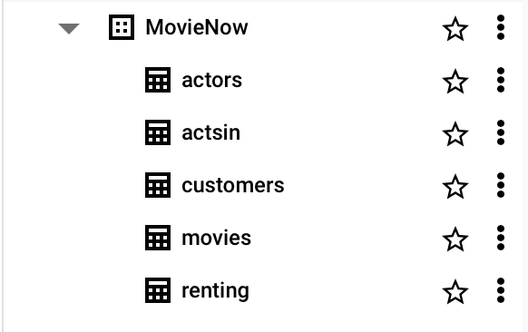
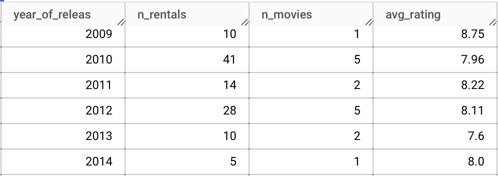
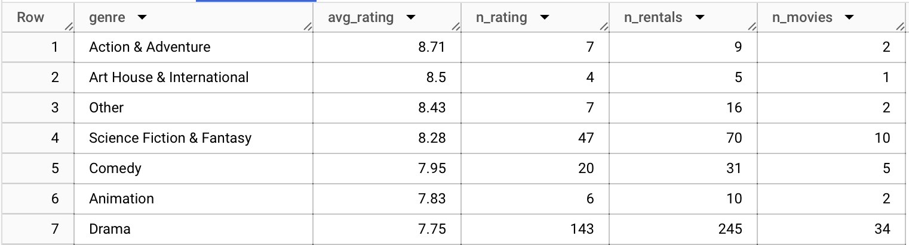
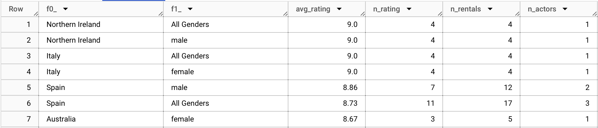
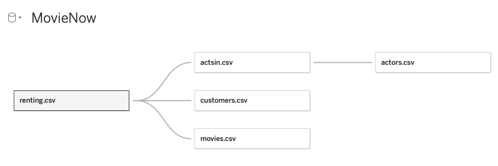

In this project, I analyze historical data from an online movie rental company in order to identify trends in customer preferences, engagement, and sales development. This highlights skills in SQL (PostgreSQL in BigQuery) like aggregate functions, joins, subqueries, OLAP, Common Table Expressions (CTE) and Window Functions. The main tools I use are SQL in Google BigQuery and Tableau. Here are the highlights:  

* [Tableau Dashboard: MovieNow Rental Analysis](https://public.tableau.com/shared/TW9BWQQ5W?:display_count=n&:origin=viz_share_link)

* [GitHub: MovieNow Rental Analysis Repository](https://github.com/andrewdeekim/movie-now)

* [Slides: MovieNow Rental Analysis](https://docs.google.com/presentation/d/e/2PACX-1vQJcFdNxcg-9ULzM0Rv3RmmJME12Q16q_jfcMqPpizal7DgSCI3rG1yDPj8R9rJBkECA87AJcJpz-tj/pub?start=false&loop=false&delayms=3000)

A more in-depth breakdown of the scenario is included below, followed by my full report.  
 

### Scenario
MovieNow is considering investing money in new movies. However, it is more expensive for MovieNow to make movies available which were recently produced than older ones.

 

***

## ASK: Defining the Business Task  
The following questions will guide the executive stakeholders for decision making:

* Do customers give better ratings to movies which were recently produced than to older ones? Is there a difference across countries?
* Which genres are the best rated?
* Who are the most popular actors?

 

***

## PREPARE: Data sources

We used historical bike trip data from 5 related tables from the DataCamp assets server. We downloaded the following CSV files:

    1)  actors.csv
    2)  actsin.csv
    3)  customers.csv
    4)  movies.csv
    5)  renting.csv

There are no issues with bias or credibility as all personal identifiable information (PII) has been removed. The data is also credible as it is primary data from the company itself. In other words, it ROCCC's:

* **Reliable and Original**: the data is both reliable and original as it is primary source data.
* **Comprehensive**: the data has all of the relevant fields necessary for our historical analysis.
* **Current**: the data is current as it is from the specific time frame we need in this scenario.
* **Cited**: the data is cited as it is verified as a primary source.
I have saved a folder of the original data and made copies to manipulate for my analysis.

 

***

## PROCESS: Data Cleaning & Manipulation

### SQL in Google BigQuery: Initial Set Up  
First, I created a dataset called MovieNow. Then, I uploaded each individual CSV file as a table labeled the same name as the file.

 

***

## ANALYZE: 

## Q1: Do Later Release Dates Yield Higher Ratings?

### Exploring the head data
We explore the first 5 rows of the tables:


### Join the data
* `renting`: records of movie rentals with ratings
* `customers`: information about the country of the customer
* `movies`: information about the country of the customer

We join the 3 related tables together:


### Select relevant records
* Use only records of movies with at least 4 ratings
* Use only records of movies rentals since 2018-04-01

We limit the query for this conditions below:


### Aggregate the data
Type of Aggregation:
* Count the number of movie rentals
* Count the number of different movies
* Calculate the average rating

Levels of Aggregation:
* Total aggregation
* For movies by year of release
* For movies by year of release separately for the country of the customers

We use the ROLLUP extension of the GROUP BY clause to perform analysis on year of release and country: 


We see the results of the last few summary rows below:

> ### INSIGHT: Intuitively, we see there is no clear pattern of movies with a later release having better ratings

## Q2: Which genres are the best rated?
We use the following SQL query below to find the average rating, the number of ratings, the number of movie rentals, and the number of distinct movies:


We see the results of the last few summary rows below:

> ### INSIGHT #1: Action & Adventure was the most popular with an average rating of 8.71, followed by Art House & International with 8.5. 
 

> ### INSIGHT #2: Drama has a significantly higher number of rentals with a lower average rating of 7.75.

## Q3: Who are the most popular actors?

We use the following query below to see each combination of the following:
* actors' nationality
* gender
* average rating
* number of ratings
* movie rentals
* number of actors

 



 

We use the `GROUP BY CUBE` function to create an aggregation on the country and gender level represented in a pivot table.

 

As an example, we see the results of the CUBE grouping for Britain below:

 

We can see the highest ratings below:

> ### INSIGHT: Northern Ireland male actors and Italian female actresses have the highest ratings, though the number of ratings and rentals are quite low.

An in-depth analysis is found in my presentation linked below.
***

## SHARE: Supporting Visualizations and Key Findings
Lastly, we export the data for visualizations in Tableau. While we can combine the 5 related tables in BigQuery and export the results as a CSV file, I chose to individually upload each file to Tableau to demonstrate my knowledge of utilizing its connection funtionality:

***

## Conclusion

### Stakeholder presentation and dashboard

I’ve provided links below for my dashboard and shareholder presentation, which 
includes the following:

* A summary of my analysis
* Supporting visualizations and key findings
* Three recommendations based on my analysis

[Tableau Dashboard: MovieNow Rental Analysis](https://public.tableau.com/shared/TW9BWQQ5W?:display_count=n&:origin=viz_share_link)

[GitHub: MovieNow Rental Analysis Repository](https://github.com/andrewdeekim/movie-now)

[Slides: MovieNow Rental Analysis](https://docs.google.com/presentation/d/e/2PACX-1vQJcFdNxcg-9ULzM0Rv3RmmJME12Q16q_jfcMqPpizal7DgSCI3rG1yDPj8R9rJBkECA87AJcJpz-tj/pub?start=false&loop=false&delayms=3000)

